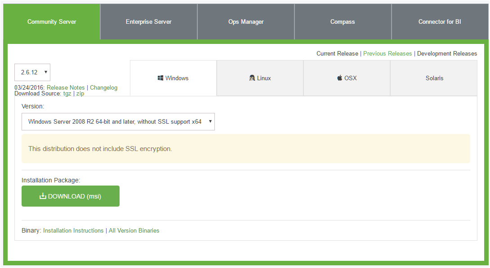

# MongoDB 
Folderstructuur, scripts, configuratie en data locatie voor Mongo DB deployment   
[Documentatie versie 2.6](https://docs.mongodb.com/v2.6/)   

## Installatie
### Installatieset 
Er moeten 1 zip bestand worden gedownload.   
- [database](https://github.com/IDgis/mongodb/releases)   
``mongodb-[versieNr].zip`` MongoDB configuratie, data lokatie en scripts    
Deze wordt eenmalig gebruikt voor de initeele MongoDB data structuur.

Download bij de opgegeven versie van de release, de zip bestanden onder:   
  **Downloads** 
       *Source code (zip)*    

   
###  MongoDB - NoSQL database systeem versie 2.6   
  Installatie van een centrale Mongo applicatie waar alle meteor applicaties mee kunnen verbinden.   
  [Mongo download center](https://www.mongodb.com/download-center#community)       
  Kies *Previous Releases*, versie 2.6.12 en download msi 'versie 2.6.12 for Windows server R2' en volg de instructies:   
  Voer het MSI bestand uit als administrator en kies 'Complete Installation'.  
     
  Mongo wordt in een van de standaard Windows folders geinstalleerd C:\Program Files of C:\Program Files (x86).   

###  Aanmaken van folder structuur en starten van MongoDB service.   
   1. Kopieer de folder ``mongodb`` uit ``mongo-[versieNr].zip`` naar een schijf.   
      Het resultaat is dan bijvoorbeeld ``C:\mongodb\``   
      (In de rest van de tekst wordt aangenomen dat de installatie in ``C:\mongodb\`` heeft plaatsgevonden)   
   2. Maak een MongoDB service als volgt:   
    Open een terminal (DOS prompt) en ga naar C:\Program Files\MongoDB 2.6 Standard\bin\   
    Voer uit:   
    ``C:\Program Files\MongoDB 2.6 Standard\bin> mongod --config  C:\mongodb\config\mongo.config --install``   
    Als schijf D: is gekozen als installatie schijf voor de database bestanden :   
    ``C:\Program Files\MongoDB 2.6 Standard\bin> mongod --config  D:\mongodb\config\mongoSchijfD.config --install``   
   3. Open Windows Service beheer en start de service MongoDB.   
    
NB. Als een andere schijf of folder wordt gebruikt, dan moeten de paden in mongo.config worden aangepast.

## Folderstructuur  
De folderstructuur als het zip bestand wordt uitgepakt op schijf C:   
    
    C:\mongodb\
     | README                     # dit bestand
     |-- backup\                  # mogelijke lokatie voor backups
     |-- config\
     |     mongo.config           # Configuratie om MongoDB als service te starten
     |     mongoSchijfD.config    # idem als folderstructuur op schijf D is geplaatst
     |-- data\                    # centrale locatie voor alle databases van de mongo service
     |-- images\                  # plaatjes voor README
     |-- logs\                    # mongo log files
     |-- scripts\                 # backup en restore scripts
     |     mongo-backup.bat
     |     mongo-restore.bat

## Backup en Restore
*Scripts voor Mongo DB backup / restore.*   
Omdat de Mongo installatie de mongo programma's niet in het Windows PATH zet, moeten de scripts als volgt worden gestart:    
Open een terminal (DOS prompt) en ga naar C:\Program Files\MongoDB 2.6 Standard\bin\   

### Backup
Om de gegevens te backuppen:  
1. voer het script ``mongo-backup`` uit voor de betreffende database.   
   ``mongo-backup.bat [folder voor database backup] [database naam]``  
   Voorbeeld:   
   ``mongo-backup.bat C:\backup\geoide-composer geoide-composer-test``  
   NB. In de opgegeven backup folder wordt een subfolder gemaakt met de naam van de database.

### Restore
Om de gegevens te herstellen:  
1. voer het script ``mongo-restore`` uit voor de betreffende database.  
   ``mongo-restore.bat [folder van database backup\subfolder met database backup] [database naam]``  
   Voorbeeld:   
   ``mongo-restore.bat C:\backup\geoide-composer\geoide-composer-test geoide-composer-test ``  
   NB. bij restore wordt de bestaande database overschreven met de gegevens uit de restore folder.  

